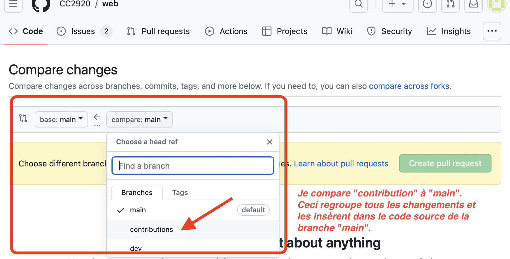
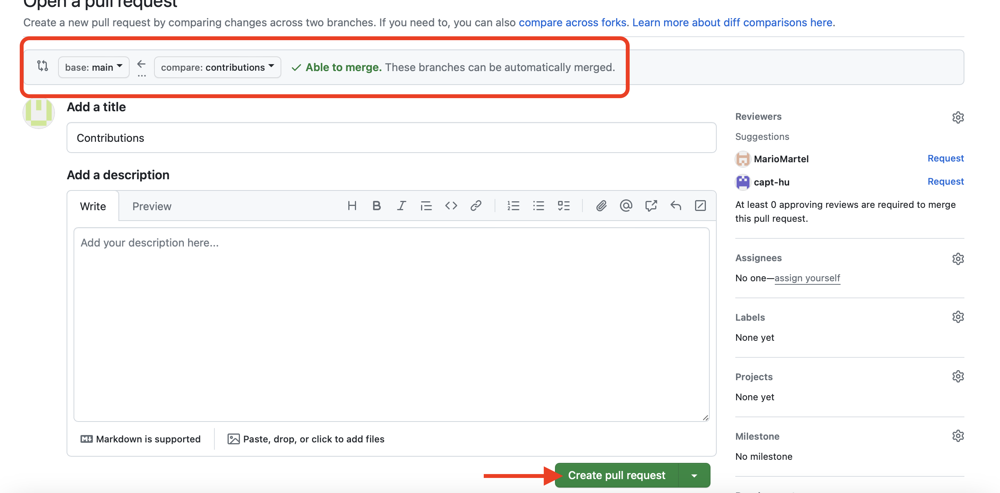
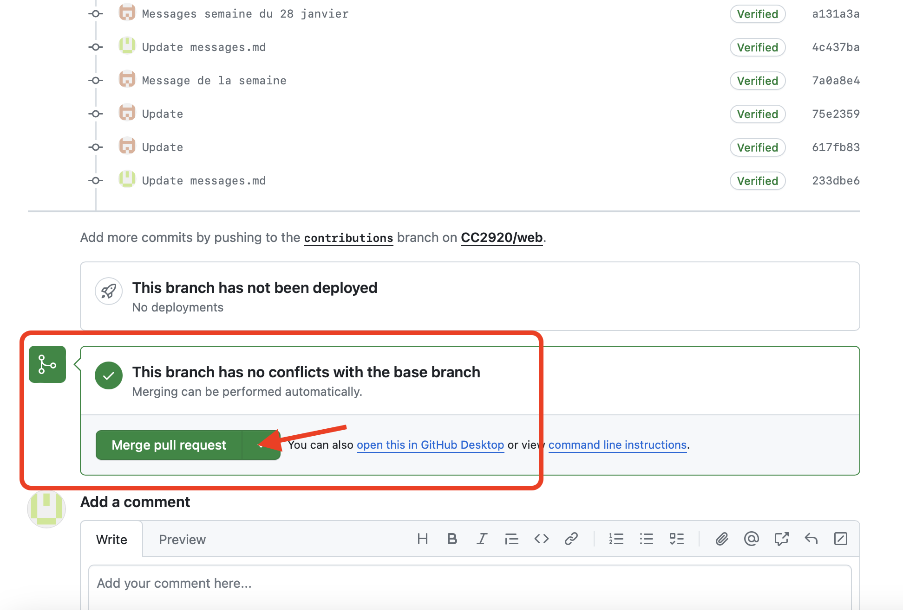
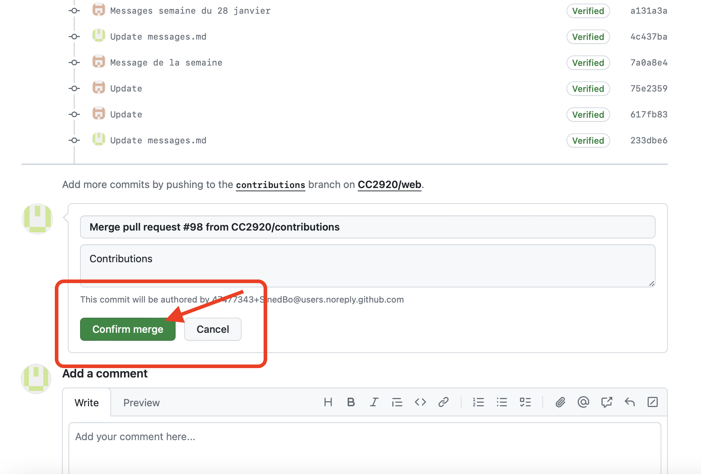
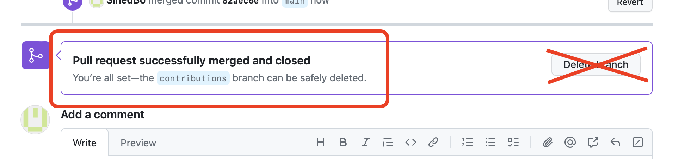
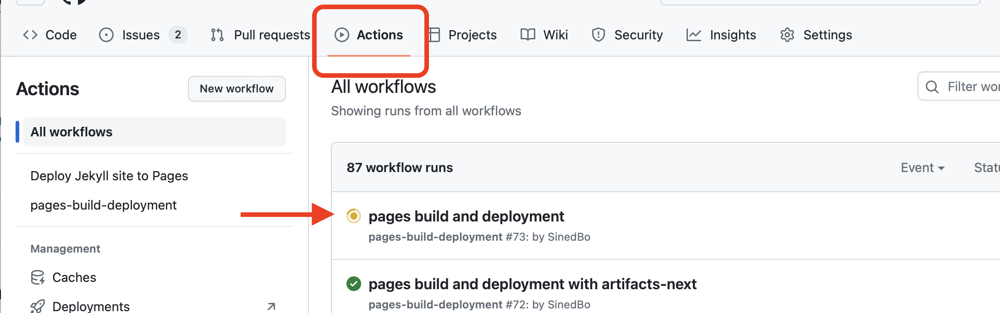

# Comment publier les messages via les Pull Request

## Fusionner les modifications avec le contenu du site

Publier les messages de la semaine et le contenu de la branche « contribution »

<https://docs.github.com/fr/pull-requests/collaborating-with-pull-requests/proposing-changes-to-your-work-with-pull-requests/about-pull-requests>

1.	Naviguez à la section « Pull Requests »
2.	Créer un « New Pull Request »

3.	Le « Pull Request » permet d’intégrer les changements (les mises à jour) de contenu ou de fichier d’une branche à une autre. 
   - Dans le cas-ci, de la branche « Contribution » à « main ». Le système va typiquement nous aviser si les modifications détectées peuvent être intégrées de façon automatique. 
   - Si des conflits sont détectés, la synchronisation va devoir être faite manuellement. 
   - Lorsque les modifications détectées par le système ont été revue, il suffit de créer le « Pull Request »

4. On peut fournir une description pour documenter, au besoin. Ensuite, on poursuit le avec le « Pull Request ».

5. Une fois que le tout est terminé, le système nous offre l'option de supprimer la branche. Cependant, dans notre cas, nous utilisons cette branche pour les mise à jour. Il ne faut donc pas la supprimer puisque le site Web s'y réfère

## La compilation du site

Les changements sont compilés et publiés par le processus automatique. Lorsque le processus termine, les modifications seront visibles directement sur le site Web.

