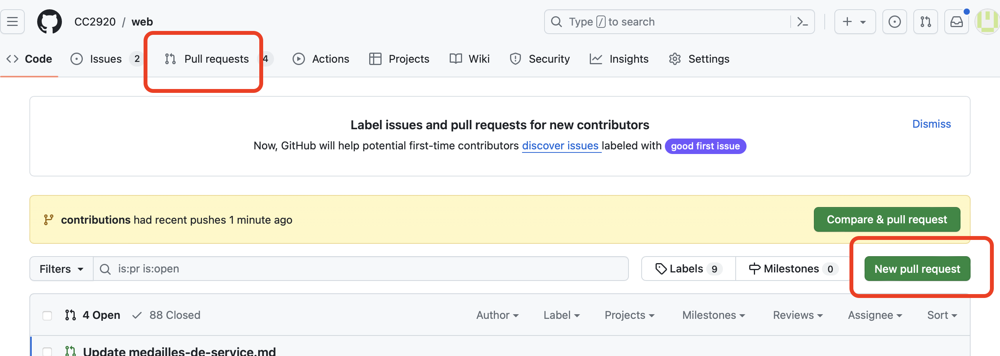
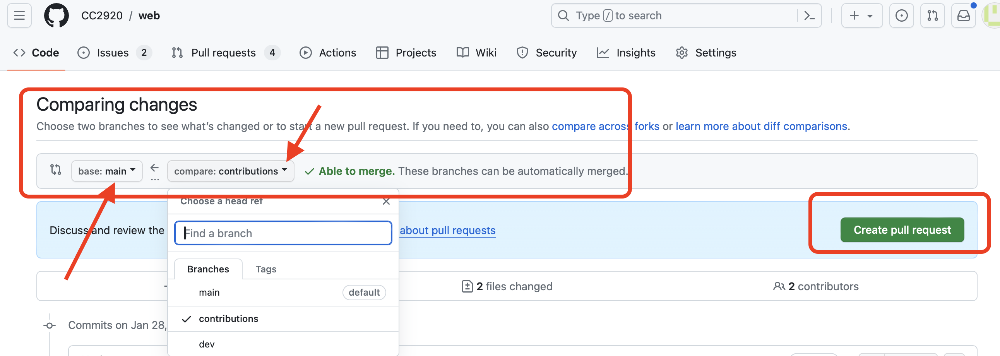

---
---
Publier les messages de la semaine et le contenu de la branche « contribution »

<https://docs.github.com/fr/pull-requests/collaborating-with-pull-requests/proposing-changes-to-your-work-with-pull-requests/about-pull-requests>

1.	Naviguez à la section « Pull Requests »
2.	Créer un « New Pull Request »

 

3.	Le « Pull Request » permet d’intégrer les changements (les mises à jour) de contenu ou de fichier d’une branche à une autre. 
   - Dans le cas-ci, de la branche « Contribution » à « main ». Le système va typiquement nous aviser si les modifications détectées peuvent être intégrées de façon automatique. 
   - Si des conflits sont détectés, la synchronisation va devoir être faite manuellement. 
   - Lorsque les modifications détectées par le système ont été revue, il suffit de créer le « Pull Request »

 
